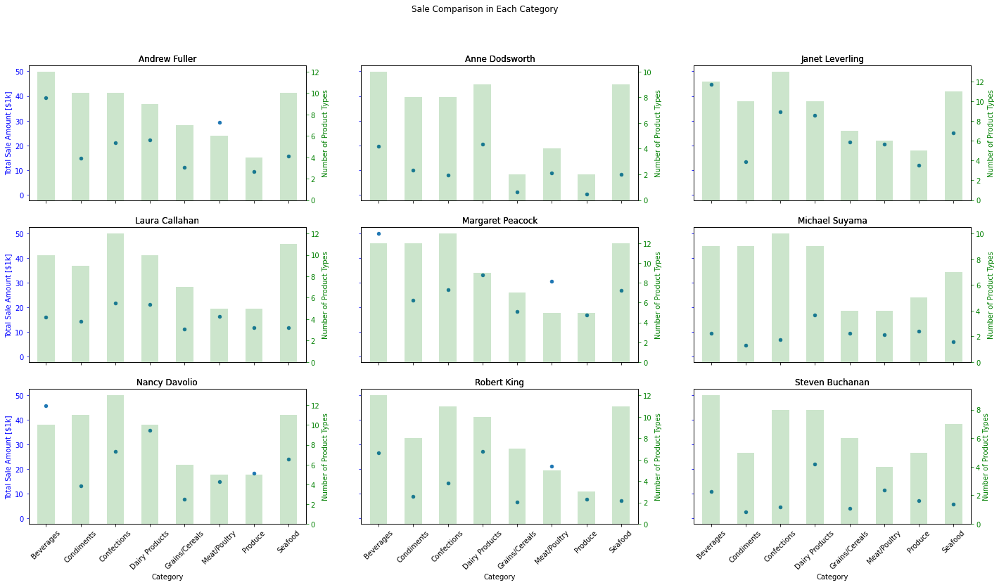
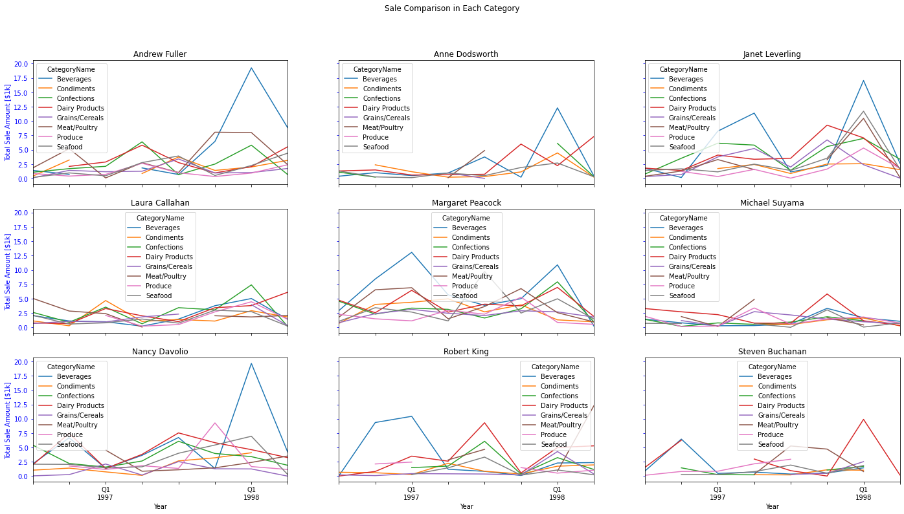
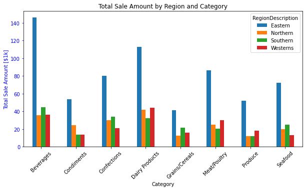
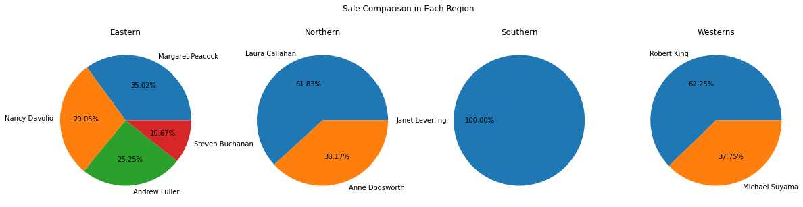

# Northwind Salesmen Database

Load Northwind sales data from a sqlite database and summarize the the data by sale agents' gender, education, experience level and regions.

[Project report](https://htmlpreview.github.io/?https://raw.githubusercontent.com/chsueh2/Northwind_Salesmen_Database/main/northwind_sales.html)

Key features:

- Exploratory data analysis (EDA)
- Histogram, Pie Chart, Bar plot, Scatter Plot
- SQL Query
- Pivot Table
- Business Analysis

Modules used:

- `numpy`: Python library used for working with arrays
- `pandas`: data manipulation and analysis. In particular, it offers data structures and operations for manipulating numerical tables and time series.
- `matplotlib.pyplot`: plotting library for creating static, animated, and interactive visualizations
- `sqlite3`: SQL interface 
- `datetime`: classes for manipulating dates and times

## Project Report

[Project report](https://htmlpreview.github.io/?https://raw.githubusercontent.com/chsueh2/Northwind_Salesmen_Database/main/northwind_sales.html) ([Jupyter Notebook](./northwind_sales.ipynb))

The analysis results with theoretical backgrounds are included.

Chien-Lan Hsueh (chienlan.hsueh at gmail.com)

## Overview and Project Goal

Conduct EDA on the training set through spark SQL to get a good understanding of the data structure. This helps identify the useful predictors to be included in the models.

- For numeric variables: inspect collinearity and determine which to include in logistic regression
- For categorical variables: recode the variable if the data distribution is imbalanced

Fit machine learning models including logistic regression and two tree-based classification models (decision tree classifier and random forest classifier) using area under ROC curve as our model selection metric (evaluator).

## Workflow

1. Load module, define a helper function and read in tables from database
2. Read in and prepare tables
3. Analysis
   - how much they sell
   - what products they are able to sell
   - how they’ve done across years
   - how they do in different regions
   - provide summary statistics and graphs with corresponding interpretation
   - describe their main strength and something they can improve upon
4. Suggestions

